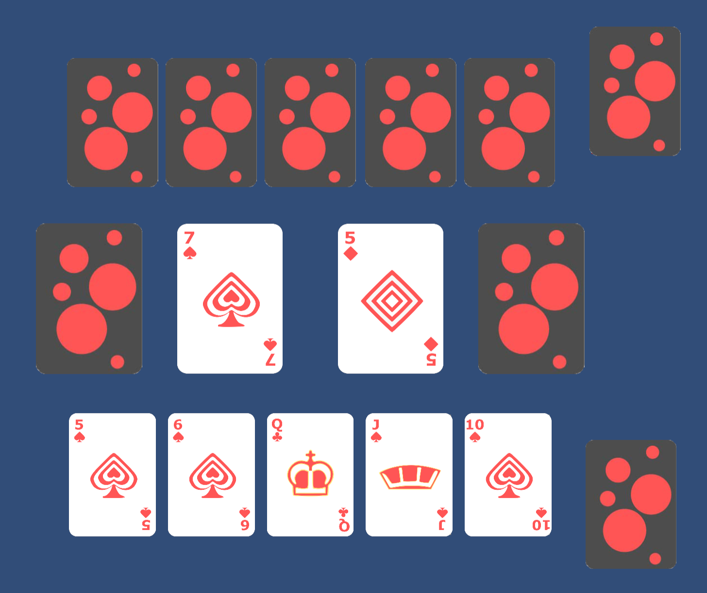

# Speed

A recreation of the card game _Speed_ in Unity powered by a Rust multiplayer server.

## Prerequisites

-   Unity
-   Rust 2021 or later

## Running

1. **Compile and run server**

-   `cargo build --release`
-   Run the produced executable

2. Run Unity project

-   Follow the [Unity WebSocket Installation Instructions](https://github.com/endel/NativeWebSocket?tab=readme-ov-file#installation)
-   Run the card game scene

## Acknolwedgements

-   [Card Game Asset Pack](https://mreliptik.itch.io/playing-cards-packs-52-cards) for Unity
-   [Native WebSocket](https://github.com/endel/NativeWebSocket) for cross-platform WebSocket communication in Unity
-   [Tokio Tungstenite](https://github.com/snapview/tokio-tungstenite) for the Rust WebSocket Library

## License

This project is licensed under the [MIT License](LICENSE)
